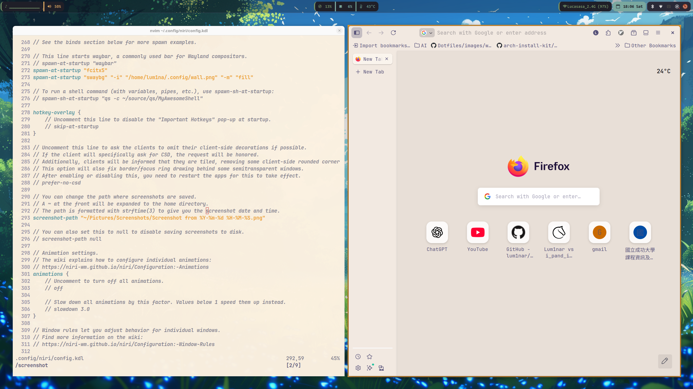
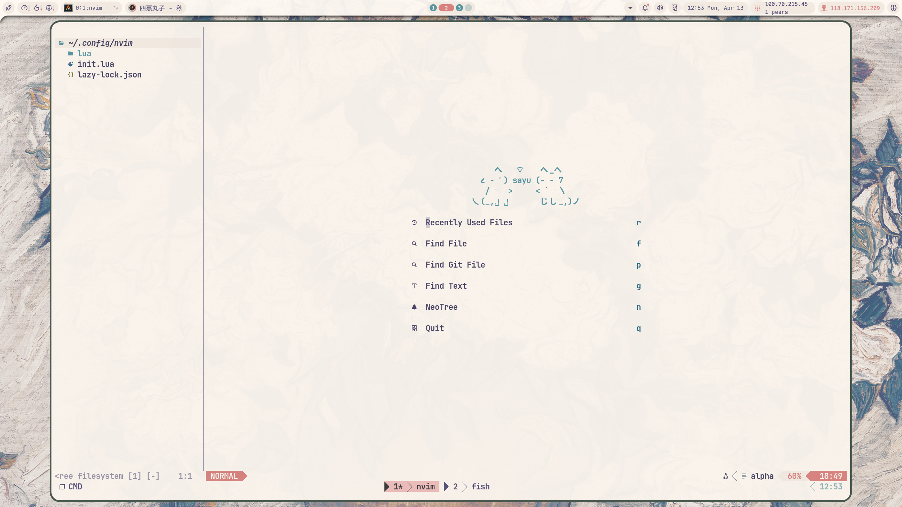

[Chinese Version](./README_zh.md)

# ✨ Modern Development Environment

A clean and minimal development setup built around **Wayland + Neovim + Zsh**.

Designed for productivity, aesthetics, and smooth workflow.

## 🖼 Preview

<p align="center">
  
  <br/><br/>
  
  <br/><br/>
  
</p>

# 🖥 Desktop Environment

### System

- **OS:** Ubuntu
- **Display Server:** Wayland
- **Window Manager:** Niri

### UI Components

- **Waybar** – Status bar
- **Swaybg** – Wallpaper manager

# 🛠 Core Applications

- **Neovim** >= 0.11
- **Tmux** – Terminal multiplexer
- **Alacritty** – GPU accelerated terminal
- **Zsh** + **Oh My Zsh**

# 🎨 Utilities · Fonts · Theme

- **GNU Stow** – Dotfile management
- **JetBrainsMono Nerd Font**
- **Rosé Pine Dawn** – Color scheme

# ⌨ Neovim Keybindings

## 📝 Text Manipulation & Navigation

| Key         | Mode   | Action                   |
| ----------- | ------ | ------------------------ |
| `J`         | Visual | Move selection down      |
| `K`         | Visual | Move selection up        |
| `space + y` | Visual | Copy to system clipboard |
| `ctrl + w`  | Insert | Delete word left         |
| `ctrl + h`  | Insert | Delete character left    |
| `ctrl + o`  | Normal | Jump back                |
| `space + f` | Normal | Format code              |
| `gcc`       | Normal | Toggle comment           |

## 📁 Project & File Management

| Key             | Mode   | Action             |
| --------------- | ------ | ------------------ |
| `space + p + f` | Normal | Find project files |
| `space + p + l` | Normal | Find git files     |
| `space + p + r` | Normal | Recent files       |
| `space + p + s` | Normal | Live grep          |
| `space + p + b` | Normal | File browser       |
| `space + p + t` | Normal | File tree          |
| `space + u`     | Normal | Toggle undotree    |

## 🧠 LSP & Code Intelligence

| Key                        | Mode          | Action                       |
| -------------------------- | ------------- | ---------------------------- |
| `ctrl + n` / `tab`         | Insert        | Next completion              |
| `ctrl + p` / `shift + tab` | Insert        | Previous completion          |
| `ctrl + y` / `Enter`       | Insert        | Confirm completion           |
| `ctrl + l`                 | Insert/Visual | Next snippet placeholder     |
| `ctrl + h`                 | Insert/Visual | Previous snippet placeholder |
| `space + d + d`            | Normal        | Go to definition             |
| `space + d + f`            | Normal        | Find references              |
| `space + d + n`            | Normal        | Next diagnostic              |
| `space + d + p`            | Normal        | Previous diagnostic          |

## ▶ Execution

| Key         | Mode   | Action                     |
| ----------- | ------ | -------------------------- |
| `space + r` | Normal | Run current file (.c, .py) |

# 🔧 Git Configuration

### Set Neovim as default editor

```bash
git config --global core.editor "nvim"
```

# 🔐 Environment Variables

Add your DeepSeek API key:

```
 ~/.zshrc.local
export DEEPSEEK_API_KEY="YOUR_API_KEY"
```

# 📦 Dotfile Management

This setup uses GNU Stow to manage configuration files.
Example:

```
stow nvim
stow zsh
```
