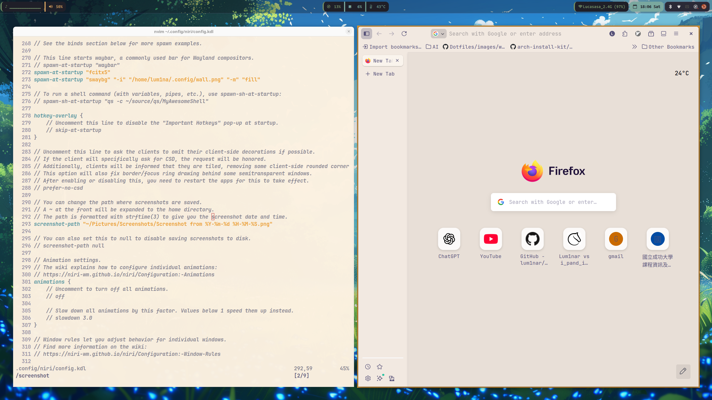
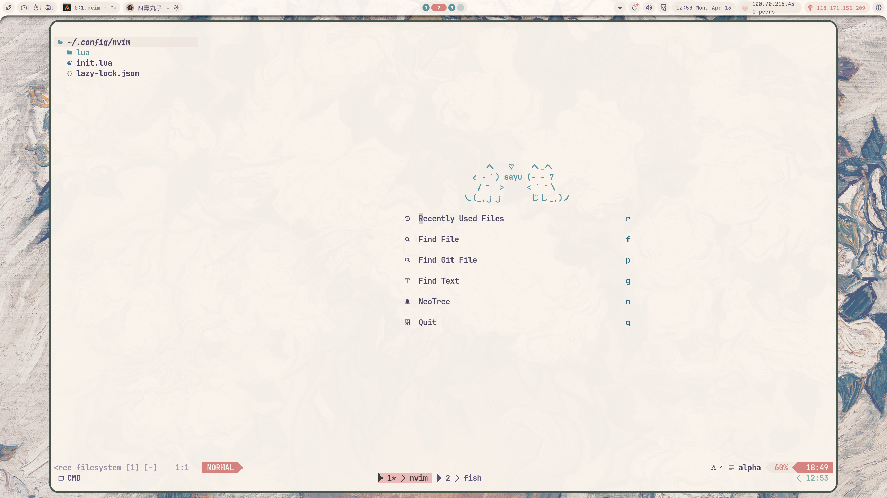

## 🖼 Preview

<p align="center">
  
  <br/><br/>
  
</p>

## System

- **OS:** [Arch Linux](https://archlinux.org/)
- **Display Server:** Wayland
- **Window Manager:** [Niri](https://github.com/YaLTeR/niri) (Scrollable tiling compositor)
- **Desktop Shell:** [Noctalia](https://github.com/m00nman/noctalia)
- **Terminal:** Alacritty
- **Shell:** Fish
- **Editor:** Neovim (managed via Lazy.nvim)
- **File Manager:** Thunar / Ranger

# Add Your LLM API key:

```
 ~/.env
OPENROUTER_API_KEY="YOUR_API_KEY"
```

# 📦 Dotfile Management

This setup uses GNU Stow to manage configuration files.
Example:

```
stow nvim
stow zsh
```
