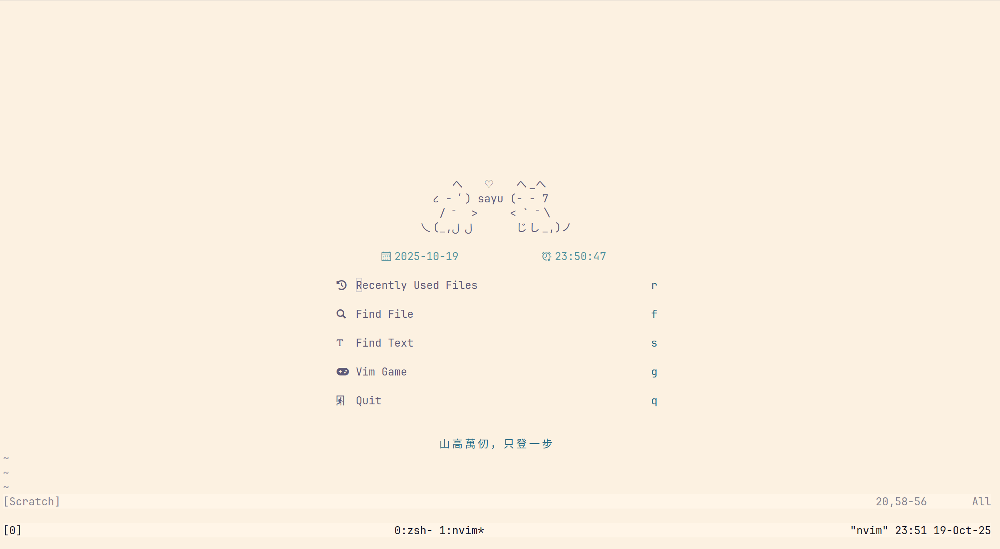

# 開發環境配置


現代化開發環境設定，包含 shell 和編輯器工具。

## 需求

### 核心應用程式

- **nvim** >= 0.11
- **lazy.nvim** - 插件管理器
- **nodejs** >= 20 - JavaScript 執行環境
- **ripgrep** - 快速檔案搜尋
- **fzf** - 模糊搜索
- **tmux** - 終端機多工器
- **alacritty** - GPU 加速終端機

### Shell 環境

- **zsh** 搭配 **oh-my-zsh**
- **p10k** - Powerlevel10k 主題
- **zsh-autosuggestions** - 自動建議
- **zsh-syntax-highlighting** - 語法高亮
- **zsh-vi-mode** - Vi 模式

### 工具與字型

- **stow** - 點檔案管理
- **JetBrainsMono Nerd Font** - 程式設計字型
- **Monocraft** - Minecraft 風格字型

## Neovim 快捷鍵配置

### 文字操作與導航

| 按鍵組合    | 模式   | 功能說明           |
| ----------- | ------ | ------------------ |
| `J`         | Visual | 將選取範圍向下移動 |
| `K`         | Visual | 將選取範圍向上移動 |
| `space + y` | Visual | 複製選取內容       |
| `ctrl + w`  | Insert | 刪除左側單詞       |
| `ctrl + h`  | Insert | 刪除左側字元       |
| `ctrl + o`  | Normal | 返回上一個跳轉位置 |
| `space + f` | Normal | 格式化程式碼       |
| `gcc`       | Normal | 切換註解狀態       |

### 專案與檔案管理

| 按鍵組合        | 模式   | 功能說明           |
| --------------- | ------ | ------------------ |
| `space + p + f` | Normal | 搜尋專案檔案       |
| `space + p + r` | Normal | 搜尋最近開啟的檔案 |
| `space + p + s` | Normal | 依內容搜尋檔案     |
| `space + p + b` | Normal | 開啟檔案瀏覽器     |
| `space + u`     | Normal | 開啟 undotree      |

### 程式碼智慧與 LSP

| 按鍵組合                   | 模式           | 功能說明                   |
| -------------------------- | -------------- | -------------------------- |
| `ctrl + n` / `tab`         | Insert         | 下一個自動完成項目         |
| `ctrl + p` / `shift + tab` | Insert         | 上一個自動完成項目         |
| `ctrl + y` / `Enter`       | Insert         | 接受 LSP 自動完成建議      |
| `ctrl + l`                 | Insert, Visual | 前往下一個程式碼片段佔位符 |
| `ctrl + h`                 | Insert, Visual | 前往上一個程式碼片段佔位符 |
| `space + d + d`            | Normal         | 前往游標下的定義           |
| `space + d + f`            | Normal         | 尋找參考                   |
| `space + d + n`            | Normal         | 前往下一個錯誤             |
| `space + d + p`            | Normal         | 前往上一個錯誤             |

### AI 整合功能

| 按鍵組合        | 模式    | 功能說明             |
| --------------- | ------- | -------------------- |
| `space + c + c` | NORMAL  | 開啟 AI 對話         |
| `space + c + a` | NORMAL  | 開啟 AI 操作選單     |
| `space + c + h` | NORMAL  | 開啟 AI 對話歷史     |
| `gcs`           | In CHAT | 為當前對話建立摘要   |
| `gbs`           | In CHAT | 瀏覽已儲存的對話摘要 |

### 專注模式與執行

| 按鍵組合        | 模式   | 功能說明               |
| --------------- | ------ | ---------------------- |
| `space + z + z` | Normal | 切換禪模式             |
| `space + r`     | Normal | 執行當前檔案 (.c, .py) |

## Git 配置

### 將 Neovim 設為預設 Git 編輯器：

```bash
git config --global core.editor "nvim"
```

### 添加 DeepSeek API

```bash
#~/.zshrc.local
export DEEPSEEK_API_KEY="YOUR_API_KEY"

```
